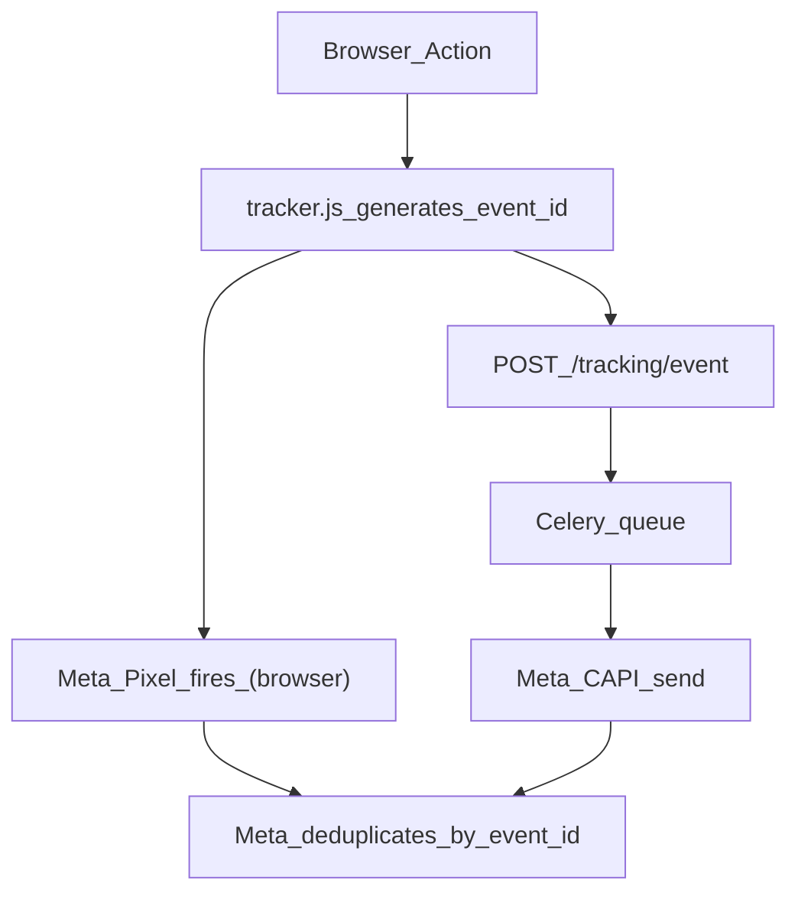
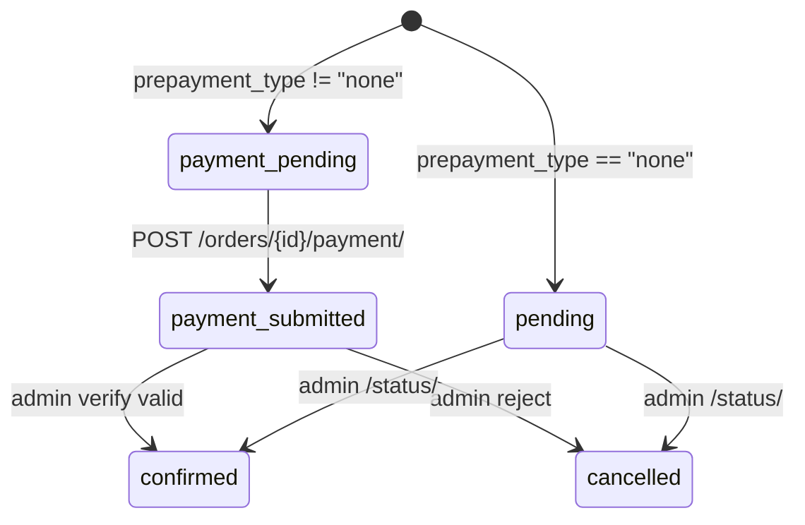

# Paperbase Storefront API — Frontend Integration Prompt

You are building a storefront frontend that integrates with the following BaaS API.

## STRICT RULES

- **DO NOT** invent endpoints or fields.
- **DO NOT** assume data shapes — use exactly what is documented below.
- **ONLY** use the API contract provided in this document.
- **ALL** requests **MUST** include the `Authorization` header.
- **DO NOT** use any backend other than this API.
- **DO NOT** send `DELETE` or `PATCH` requests — they are not supported.
- **DO NOT** send unknown fields in any request body — the server returns `400` immediately.
- **DO NOT** use internal numeric IDs — always use prefixed `public_id` strings.

---

## 1. Base Configuration

| Setting         | Value                                          |
| --------------- | ---------------------------------------------- |
| **Base URL**    | `{BACKEND_ORIGIN}/api/v1/`                     |
| **Auth method** | Bearer token (publishable API key)             |
| **Key prefix**  | `ak_pk_...` (publishable, allowed)             |
| **Page size**   | 24 items per page                              |

### Required Headers

| Header           | Value                          | When                                    |
| ---------------- | ------------------------------ | --------------------------------------- |
| `Authorization`  | `Bearer ak_pk_<key>`          | **Every** request                       |
| `Content-Type`   | `application/json`             | POST requests with JSON body            |
| `Content-Type`   | `multipart/form-data`          | Support ticket with file attachments    |

> Keys starting with `ak_sk_...` (secret keys) are rejected with `403`. Only use publishable keys (`ak_pk_...`).

### Store Resolution

The store is resolved entirely from the API key. No separate store ID, domain header, or user token is needed.

---

## 🔥 Meta Pixel + CAPI Tracking Integration (MANDATORY FOR ALL STORES)

### 1. Include `tracker.js` script

Add this script tag to **every page** (including product pages and checkout):

```html
<script src="https://storage.paperbase.me/static/tracker.js?v=BUILD_ID"></script>
```

**IMPORTANT (caching):**
- `BUILD_ID` is injected by the backend automatically (read it from `GET /api/v1/store/public/` → `tracker_build_id` / `tracker_script_src`).
- Store owners must **NOT** manually change `BUILD_ID`.
- Do **NOT** use an unversioned `tracker.js` URL in production. Always use the versioned `?v=...` form to avoid browser/CDN stale cache.

### 2. Initialization (IMPORTANT)

`tracker.js` auto-initializes:
- PageView tracking
- cookie collection (`_fbp`, `_fbc`)
- event system + `event_id` generation (used for Meta Pixel + CAPI dedup)

Ensure your publishable key is available as **one** of:
- `window.PAPERBASE_PUBLISHABLE_KEY = "ak_pk_...";`, or
- `window.__PAPERBASE_API_KEY__ = "ak_pk_...";`, or
- call `tracker.init({ apiKey: "ak_pk_..." })`

Optional debug mode:

```js
tracker.init({ apiKey: "ak_pk_...", debug: true });
```

Tracking behavior:
- `tracker.js` sends events to: `https://api.paperbase.me/tracking/event`

### 3. Supported events (whitelisted)

Stores automatically get these events only:
- `PageView`
- `ViewContent`
- `AddToCart`
- `InitiateCheckout`
- `Purchase`

### 4. No manual Meta Pixel setup required

**Do not add your own `fbq` initialization.**

The system handles:
- Pixel firing (browser)
- CAPI syncing (server)
- Deduplication via the same `event_id`

### 5. How tracking works (dedup flow)



### 6. Requirements for store owners

You must ensure:
- `tracker.js` is loaded on **all** pages
- checkout pages include the script
- you do not add duplicate Pixel / `fbq` scripts
- your site is HTTPS

### 7. DO NOTs (VERY IMPORTANT)

Store owners must NOT:
- manually fire `fbq` events
- manually send Meta CAPI events
- override or generate your own `event_id`
- modify `tracker.js`

### 8. Troubleshooting

- **No events**: verify the publishable API key (`ak_pk_...`) is present and correct.
- **No dedup / duplicated server events**: this means `event_id` mismatch; it should not happen unless custom code modifies payloads.
- **Missing Purchase**: confirm the checkout/thank-you page includes `tracker.js` and is not blocked by CSP/ad-blockers.
---

## 2. Allowed Endpoints (Complete List)

| Method | Path                                 | Purpose                        |
| ------ | ------------------------------------ | ------------------------------ |
| GET    | `/api/v1/store/public/`              | Store branding and config      |
| GET    | `/api/v1/products/`                  | List products (paginated)      |
| GET    | `/api/v1/products/<identifier>/`     | Single product detail          |
| GET    | `/api/v1/products/<identifier>/related/` | Related products           |
| GET    | `/api/v1/products/search/`           | Product-only search (paginated)|
| GET    | `/api/v1/categories/`                | List or tree of categories     |
| GET    | `/api/v1/categories/<slug>/`         | Single category by slug        |
| GET    | `/api/v1/catalog/filters/`           | Filter sidebar metadata        |
| GET    | `/api/v1/banners/`                   | Active promotional banners     |
| GET    | `/api/v1/notifications/active/`      | Active CTA notifications       |
| GET    | `/api/v1/shipping/zones/`            | Shipping zones with cost rules |
| GET    | `/api/v1/shipping/options/`          | Shipping methods for a zone    |
| POST   | `/api/v1/shipping/preview/`          | Server-side shipping quote     |
| POST   | `/api/v1/orders/initiate-checkout/`  | Signal checkout start          |
| POST   | `/api/v1/orders/`                    | Create order                   |
| POST   | `/api/v1/orders/<public_id>/payment/`| Submit transaction for prepayment |
| POST   | `/api/v1/pricing/preview/`           | Single-product pricing preview |
| POST   | `/api/v1/pricing/breakdown/`         | Full-cart pricing breakdown    |
| GET    | `/api/v1/search/`                    | Combined product + category search |
| POST   | `/api/v1/support/tickets/`           | Submit support ticket          |

No other endpoints exist. Do not call any path not listed above.

---

## 3. Response Envelope Formats

### Paginated List

Used by: `GET /products/`, `GET /products/search/`, `GET /categories/` (flat mode).

```json
{
  "count": 42,
  "next": "https://api.example.com/api/v1/products/?page=2",
  "previous": null,
  "results": [ ...items ]
}
```

- `next` / `previous` are full URLs or `null`.
- Page size is 24.

### Unpaginated Array

Used by: banners, notifications, shipping zones, shipping options, related products, categories (tree mode), search results.

```json
[ ...items ]
```

### Single Object

Used by: product detail, category detail, store public.

```json
{ ...fields }
```

> Responses are returned **directly** — they are NOT wrapped in `{ "data": ... }`.

---

## 4. ID Prefix Reference

Always use these prefixed string IDs. Never send raw numeric IDs.

| Prefix  | Entity            |
| ------- | ----------------- |
| `prd_`  | Product           |
| `cat_`  | Category          |
| `var_`  | Variant           |
| `img_`  | Product image     |
| `atr_`  | Attribute         |
| `atv_`  | Attribute value   |
| `ban_`  | Banner            |
| `szn_`  | Shipping zone     |
| `smt_`  | Shipping method   |
| `srt_`  | Shipping rate     |
| `ord_`  | Order             |
| `tkt_`  | Support ticket    |
| `cta_`  | Notification      |

---

## 5. Data Type Rules

| Context                                     | Type            | Example      |
| ------------------------------------------- | --------------- | ------------ |
| Most monetary fields                        | string decimal  | `"599.00"`   |
| `price_range.min` / `max` (catalog filters) | float           | `99.0`       |
| `cost_rules` fields (shipping zones)        | float           | `60.0`       |
| All dates                                   | ISO 8601 string | `"2025-06-01T00:00:00+06:00"` |

---

## 6. Endpoints — Full Specification

---

### 6.1 GET `/api/v1/store/public/`

Returns store branding, currency, SEO defaults, social links, policy URLs, and custom field schema.

**Query params:** none.

**Response `200`:**

```json
{
  "store_name": "My Store",
  "logo_url": "https://api.example.com/media/stores/str_xxx/logo/main.png",
  "currency": "BDT",
  "currency_symbol": "৳",
  "country": "BD",
  "support_email": "help@mystore.com",
  "phone": "01712345678",
  "address": "123 Main St, Dhaka",
  "extra_field_schema": [
    {
      "id": "warranty",
      "entityType": "product",
      "name": "Warranty",
      "fieldType": "text",
      "required": false,
      "order": 1,
      "options": []
    }
  ],
  "modules_enabled": { "products": true, "orders": true, "customers": true },
  "theme_settings": { "primary_color": "#2563eb" },
  "seo": {
    "default_title": "My Store - Best Products",
    "default_description": "Shop the best products online"
  },
  "policy_urls": {
    "returns": "https://mystore.com/returns",
    "refund": "https://mystore.com/refund",
    "privacy": "https://mystore.com/privacy"
  },
  "social_links": {
    "facebook": "https://facebook.com/mystore",
    "instagram": "https://instagram.com/mystore",
    "twitter": "",
    "youtube": "",
    "linkedin": "",
    "tiktok": "",
    "pinterest": "",
    "website": "https://mystore.com"
  }
}
```

**Fields:**

| Field | Type | Notes |
|---|---|---|
| `store_name` | string | Store display name |
| `logo_url` | string or null | Absolute URL |
| `currency` | string | e.g. `"BDT"` |
| `currency_symbol` | string | e.g. `"৳"` |
| `country` | string | Country code |
| `support_email` | string | Contact email |
| `phone` | string | Store phone |
| `address` | string | Physical address |
| `extra_field_schema` | array | Custom field definitions for products |
| `modules_enabled` | object | Boolean feature flags |
| `theme_settings.primary_color` | string | Hex color |
| `seo.default_title` | string | Default page title |
| `seo.default_description` | string | Default meta description |
| `policy_urls.returns` | string | Returns policy URL |
| `policy_urls.refund` | string | Refund policy URL |
| `policy_urls.privacy` | string | Privacy policy URL |
| `social_links` | object | 8 keys always present: `facebook`, `instagram`, `twitter`, `youtube`, `linkedin`, `tiktok`, `pinterest`, `website` |

---

### 6.2 GET `/api/v1/products/`

List products. Paginated (24 per page).

**Query params:**

| Param | Type | Description |
|---|---|---|
| `page` | int | Page number (default: 1) |
| `category` | string | Category slug(s), comma-separated (includes descendants) |
| `brand` | string | Brand name(s), comma-separated |
| `search` | string | Text search across name, description, brand |
| `price_min` | decimal | Minimum price filter |
| `price_max` | decimal | Maximum price filter |
| `attributes` | string | Attribute value `public_id`s, comma-separated |
| `ordering` or `sort` | string | `newest` (default), `price_asc`, `price_desc`, `popularity` |

**Response `200`:**

```json
{
  "count": 42,
  "next": "https://api.example.com/api/v1/products/?page=2",
  "previous": null,
  "results": [
    {
      "public_id": "prd_abc123",
      "name": "Premium T-Shirt",
      "brand": "BrandX",
      "price": "599.00",
      "original_price": "799.00",
      "image_url": "https://api.example.com/media/.../main.jpg",
      "category_public_id": "cat_def456",
      "category_slug": "clothing",
      "category_name": "Clothing",
      "slug": "premium-t-shirt",
      "stock_status": "in_stock",
      "available_quantity": 50,
      "variant_count": 3,
      "extra_data": { "warranty": "1 year" }
    }
  ]
}
```

**Product list item fields:**

| Field | Type | Notes |
|---|---|---|
| `public_id` | string | Prefix: `prd_` |
| `name` | string | Product name |
| `brand` | string or null | Brand name |
| `price` | string decimal | Current selling price |
| `original_price` | string or null | Original price; `null` if no discount |
| `image_url` | string or null | Main product image URL |
| `category_public_id` | string | Prefix: `cat_` |
| `category_slug` | string | Category URL slug |
| `category_name` | string | Category display name |
| `slug` | string | Product URL slug (unique per store) |
| `stock_status` | string | `"in_stock"` or `"low_stock"` or `"out_of_stock"` |
| `available_quantity` | integer | Total available stock |
| `variant_count` | integer | Number of active variants |
| `extra_data` | object | Custom fields per store schema |

---

### 6.3 GET `/api/v1/products/<identifier>/`

Single product detail. `<identifier>` can be a `public_id` (e.g. `prd_abc123`) or a `slug` (e.g. `premium-t-shirt`).

**Response `200`:**

```json
{
  "public_id": "prd_abc123",
  "name": "Premium T-Shirt",
  "brand": "BrandX",
  "stock_tracking": true,
  "slug": "premium-t-shirt",
  "price": "599.00",
  "original_price": "799.00",
  "image_url": "https://api.example.com/media/.../main.jpg",
  "images": [
    {
      "public_id": "img_xyz789",
      "image_url": "https://api.example.com/media/.../gallery-1.jpg",
      "alt": "Front view",
      "order": 0
    }
  ],
  "category_public_id": "cat_def456",
  "category_slug": "clothing",
  "category_name": "Clothing",
  "description": "A premium cotton t-shirt...",
  "stock_status": "in_stock",
  "available_quantity": 50,
  "variants": [
    {
      "public_id": "var_ghi012",
      "sku": "MYSTR-A1B2C3",
      "available_quantity": 20,
      "stock_status": "in_stock",
      "price": "599.00",
      "options": [
        {
          "attribute_public_id": "atr_size01",
          "attribute_slug": "size",
          "attribute_name": "Size",
          "value_public_id": "atv_xl01",
          "value": "XL"
        }
      ]
    }
  ],
  "extra_data": { "warranty": "1 year" }
}
```

**Additional fields (beyond list item):**

| Field | Type | Notes |
|---|---|---|
| `stock_tracking` | boolean | Whether stock is tracked |
| `description` | string | Full product description |
| `images` | array | Gallery images |
| `variants` | array | Active product variants |

**Image object:**

| Field | Type | Notes |
|---|---|---|
| `public_id` | string | Prefix: `img_` |
| `image_url` | string or null | Absolute URL |
| `alt` | string | Alt text |
| `order` | integer | Display order |

**Variant object:**

| Field | Type | Notes |
|---|---|---|
| `public_id` | string | Prefix: `var_` |
| `sku` | string | Stock keeping unit |
| `available_quantity` | integer | Stock for this variant |
| `stock_status` | string | `"in_stock"` or `"low_stock"` or `"out_of_stock"` |
| `price` | string decimal | Variant price |
| `options` | array | Attribute-value pairs |

**Variant option object:**

| Field | Type | Notes |
|---|---|---|
| `attribute_public_id` | string | Prefix: `atr_` |
| `attribute_slug` | string | e.g. `"size"`, `"color"` |
| `attribute_name` | string | e.g. `"Size"`, `"Color"` |
| `value_public_id` | string | Prefix: `atv_` |
| `value` | string | e.g. `"XL"`, `"Red"` |

---

### 6.4 GET `/api/v1/products/<identifier>/related/`

Returns related products from the same category. Unpaginated array. Each item has the same shape as a product list item (section 6.2). The current product is excluded.

**Response `200`:**

```json
[ { ...product_list_item }, ... ]
```

---

### 6.5 GET `/api/v1/products/search/`

Product-only search. Paginated.

**Query params:**

| Param | Required | Notes |
|---|---|---|
| `q` | **YES** | Minimum 2 characters. Returns empty results if shorter. |
| `page` | no | Page number |

**Response `200`:** Paginated envelope with product list items as `results`.

---

### 6.6 GET `/api/v1/categories/`

List or tree of categories.

**Query params:**

| Param | Values | Effect |
|---|---|---|
| `tree` | `"1"`, `"true"`, `"yes"` | Returns hierarchical tree (unpaginated array) |

**Flat response (no `tree` param) — paginated:**

```json
{
  "count": 5,
  "next": null,
  "previous": null,
  "results": [
    {
      "public_id": "cat_def456",
      "name": "Clothing",
      "slug": "clothing",
      "description": "All clothing items",
      "image_url": "https://api.example.com/media/.../cat.jpg",
      "parent_public_id": null,
      "order": 0
    }
  ]
}
```

**Tree response (`?tree=1`) — unpaginated array:**

```json
[
  {
    "public_id": "cat_def456",
    "name": "Clothing",
    "slug": "clothing",
    "description": "All clothing items",
    "image_url": "...",
    "parent_public_id": null,
    "order": 0,
    "children": [
      {
        "public_id": "cat_ghi789",
        "name": "T-Shirts",
        "slug": "t-shirts",
        "description": "",
        "image_url": null,
        "parent_public_id": "cat_def456",
        "order": 0,
        "children": []
      }
    ]
  }
]
```

**Category fields:**

| Field | Type | Notes |
|---|---|---|
| `public_id` | string | Prefix: `cat_` |
| `name` | string | Display name |
| `slug` | string | URL slug (unique per store) |
| `description` | string | Category description |
| `image_url` | string or null | Absolute URL |
| `parent_public_id` | string or null | Parent ID; `null` = top-level |
| `order` | integer | Display order among siblings |
| `children` | array | Tree mode only — nested child categories |

---

### 6.7 GET `/api/v1/categories/<slug>/`

Returns a single category object — same fields as flat list item, without `children`.

---

### 6.8 GET `/api/v1/catalog/filters/`

Returns aggregate filter metadata for building a filter sidebar.

**Response `200`:**

```json
{
  "categories": [
    { "public_id": "cat_abc", "name": "Clothing", "slug": "clothing" },
    { "public_id": "cat_def", "name": "Accessories", "slug": "accessories" }
  ],
  "attributes": {
    "size": [
      { "public_id": "atv_s01", "value": "S" },
      { "public_id": "atv_m01", "value": "M" },
      { "public_id": "atv_l01", "value": "L" }
    ],
    "color": [
      { "public_id": "atv_red01", "value": "Red" },
      { "public_id": "atv_blue01", "value": "Blue" }
    ]
  },
  "brands": ["BrandX", "BrandY"],
  "price_range": { "min": 99.0, "max": 5999.0 }
}
```

**Fields:**

| Field | Type | Notes |
|---|---|---|
| `categories` | array | Categories with active products. Each: `{ public_id, name, slug }` |
| `attributes` | object | Keys = attribute slugs; values = `[{ public_id, value }]` |
| `brands` | string[] | Distinct non-empty brand names |
| `price_range.min` | float | Minimum product price (use as slider lower bound) |
| `price_range.max` | float | Maximum product price (use as slider upper bound) |

> `price_range` values are **float** (not string decimal).

---

### 6.9 GET `/api/v1/banners/`

Active promotional banners. Unpaginated array.

**Query params:**

| Param | Type | Notes |
|---|---|---|
| `slot` | string | Optional — filter by placement slot |

**Valid `slot` values:** `home_top`, `home_mid`, `home_bottom`

Any other placement value is invalid and will be rejected by the API.

**Response `200`:**

```json
[
  {
    "public_id": "ban_abc123",
    "title": "Summer Sale - 30% Off",
    "image_url": "https://api.example.com/media/.../banner.jpg",
    "cta_text": "Shop Now",
    "cta_url": "https://mystore.com/sale",
    "order": 0,
    "placement_slots": ["home_top"],
    "start_at": "2025-06-01T00:00:00+06:00",
    "end_at": "2025-06-30T23:59:59+06:00"
  }
]
```

**Fields:**

| Field | Type | Notes |
|---|---|---|
| `public_id` | string | Prefix: `ban_` |
| `title` | string | Banner title |
| `image_url` | string or null | Banner image URL |
| `cta_text` | string | Button text |
| `cta_url` | string | Button link |
| `order` | integer | Display order (sort ascending) |
| `placement_slots` | string[] | Where to render the banner |
| `start_at` | string or null | ISO 8601 schedule start |
| `end_at` | string or null | ISO 8601 schedule end |

**Rendering rules:**
- Filter banners client-side by `placement_slots`, or pass `?slot=home_top` to the API.
- A banner can appear in multiple slots.
- Sort by `order` ascending.
- The backend only returns active, in-schedule banners — no client-side schedule checking needed.

---

### 6.10 GET `/api/v1/notifications/active/`

Active CTA notifications. Unpaginated array.

**Response `200`:**

```json
[
  {
    "public_id": "cta_abc123",
    "cta_text": "Free shipping on orders over ৳500!",
    "notification_type": "promo",
    "cta_url": "https://mystore.com/promo",
    "cta_label": "Learn More",
    "order": 0,
    "is_active": true,
    "is_currently_active": true,
    "start_at": "2025-01-01T00:00:00+06:00",
    "end_at": null
  }
]
```

**Fields:**

| Field | Type | Notes |
|---|---|---|
| `public_id` | string | Prefix: `cta_` |
| `cta_text` | string | Display text (max 500 chars) |
| `notification_type` | string | `"banner"` or `"alert"` or `"promo"` |
| `cta_url` | string or null | Link URL |
| `cta_label` | string | Link text |
| `order` | integer | Display order |
| `is_active` | boolean | Admin has enabled it |
| `is_currently_active` | boolean | Active AND within schedule window |
| `start_at` | string or null | ISO 8601 |
| `end_at` | string or null | ISO 8601 |

> Only render notifications where `is_currently_active === true`. The `is_active` field alone is **not sufficient** — it does not account for schedule.

---

### 6.11 GET `/api/v1/shipping/zones/`

All shipping zones with cost rules. Unpaginated array.

**Response `200`:**

```json
[
  {
    "zone_public_id": "szn_dhaka01",
    "name": "Inside Dhaka",
    "estimated_days": "1-2",
    "is_active": true,
    "created_at": "2025-01-15T10:30:00+06:00",
    "updated_at": "2025-03-20T14:00:00+06:00",
    "cost_rules": [
      { "min_order_total": 0.0, "shipping_cost": 60.0 },
      { "min_order_total": 500.0, "shipping_cost": 0.0 }
    ]
  }
]
```

**Zone fields:**

| Field | Type | Notes |
|---|---|---|
| `zone_public_id` | string | Prefix: `szn_` |
| `name` | string | Zone display name |
| `estimated_days` | string | e.g. `"1-2"` (display text) |
| `is_active` | boolean | Whether zone is active |
| `created_at` | string or null | ISO 8601 |
| `updated_at` | string or null | ISO 8601 |
| `cost_rules` | array | Price brackets (float values) |

**Cost rule fields:**

| Field | Type | Notes |
|---|---|---|
| `min_order_total` | float | Min subtotal for this rule |
| `max_order_total` | float | Optional — max subtotal |
| `shipping_cost` | float | Shipping price for this bracket |

---

### 6.12 GET `/api/v1/shipping/options/`

Shipping methods for a specific zone. Unpaginated array.

**Query params:**

| Param | Required | Notes |
|---|---|---|
| `zone_public_id` | **YES** | Shipping zone ID (prefix: `szn_`) |
| `order_total` | no | Order total for rate filtering |

**Response `200`:**

```json
[
  {
    "rate_public_id": "srt_abc123",
    "method_public_id": "smt_def456",
    "method_name": "Standard Delivery",
    "method_type": "standard",
    "method_order": 0,
    "zone_public_id": "szn_dhaka01",
    "zone_name": "Inside Dhaka",
    "price": "60.00",
    "rate_type": "flat",
    "min_order_total": null,
    "max_order_total": null
  }
]
```

**Fields:**

| Field | Type | Notes |
|---|---|---|
| `rate_public_id` | string | Prefix: `srt_` |
| `method_public_id` | string | Prefix: `smt_` — use this in order create body |
| `method_name` | string | Display name |
| `method_type` | string | `"standard"` or `"express"` or `"pickup"` or `"other"` |
| `method_order` | integer | Display order |
| `zone_public_id` | string | Zone identifier |
| `zone_name` | string | Zone display name |
| `price` | string decimal | Shipping cost |
| `rate_type` | string | `"flat"` or `"weight"` or `"order_total"` |
| `min_order_total` | string or null | Min order total for this rate |
| `max_order_total` | string or null | Max order total for this rate |

---

### 6.13 POST `/api/v1/shipping/preview/`

Server-side shipping cost quote.

**Request body:**

```json
{
  "zone_public_id": "szn_dhaka01",
  "items": [
    {
      "product_public_id": "prd_abc123",
      "variant_public_id": "var_ghi012",
      "quantity": 2
    }
  ]
}
```

| Field | Required | Notes |
|---|---|---|
| `zone_public_id` | **YES** | Shipping zone |
| `items` | **YES** | Non-empty array |
| `items[].product_public_id` | **YES** | Product ID |
| `items[].variant_public_id` | no | Variant ID |
| `items[].quantity` | **YES** | Must be > 0 |

**Response `200`:**

```json
{
  "shipping_cost": "60.00",
  "estimated_days": "1-2",
  "currency": "BDT"
}
```

---

### 6.14 POST `/api/v1/orders/initiate-checkout/`

Signal that the customer has entered the checkout page. Fires a server-side analytics event. Body can be empty `{}`.

**Response `200`:**

```json
{ "status": "ok" }
```

---

### 6.15 POST `/api/v1/orders/`

Create an order. **Only send the documented fields below** — unknown fields return `400` immediately.

**Request body:**

```json
{
  "shipping_zone_public_id": "szn_dhaka01",
  "shipping_method_public_id": "smt_def456",
  "shipping_name": "John Doe",
  "phone": "01712345678",
  "email": "john@example.com",
  "shipping_address": "123 Main St, Dhaka",
  "district": "Dhaka",
  "products": [
    { "product_public_id": "prd_abc123", "quantity": 2, "variant_public_id": "var_ghi012" },
    { "product_public_id": "prd_xyz789", "quantity": 1 }
  ]
}
```

**Allowed fields (only these):**

| Field | Required | Validation |
|---|---|---|
| `shipping_zone_public_id` | **YES** | Active zone for this store |
| `shipping_method_public_id` | no | Active method for this store |
| `shipping_name` | **YES** | Max 255 chars, non-empty |
| `phone` | **YES** | Exactly 11 digits, starts with `01`, numbers only |
| `email` | no | Valid email format |
| `shipping_address` | **YES** | Non-empty |
| `district` | no | Max 100 chars |
| `products` | **YES** | Min 1 item |
| `products[].product_public_id` | **YES** | Must start with `prd_` |
| `products[].quantity` | **YES** | 1–1000 |
| `products[].variant_public_id` | no | Only send if product has variants |

**Response `201 Created`:**

```json
{
  "public_id": "ord_abc123",
  "order_number": "ORD-00001",
  "status": "pending",
  "customer_name": "John Doe",
  "phone": "01712345678",
  "shipping_address": "123 Main St, Dhaka",
  "items": [
    {
      "product_name": "Premium T-Shirt",
      "quantity": 2,
      "unit_price": "599.00",
      "total_price": "1198.00",
      "variant_details": "Size: XL, Color: Red"
    }
  ],
  "subtotal": "1198.00",
  "shipping_cost": "60.00",
  "total": "1258.00"
}
```

**Response fields:**

| Field | Type | Notes |
|---|---|---|
| `public_id` | string | Prefix: `ord_` |
| `order_number` | string | Human-readable e.g. `"ORD-00001"` |
| `status` | string | Always `"pending"` on creation |
| `customer_name` | string | From `shipping_name` |
| `phone` | string | Customer phone |
| `shipping_address` | string | Delivery address |
| `items[].product_name` | string | Frozen product name at order time |
| `items[].quantity` | integer | Ordered quantity |
| `items[].unit_price` | string decimal | Price per unit at order time |
| `items[].total_price` | string decimal | `unit_price × quantity` |
| `items[].variant_details` | string or null | e.g. `"Size: XL, Color: Red"` |
| `subtotal` | string decimal | Merchandise total |
| `shipping_cost` | string decimal | Shipping cost |
| `total` | string decimal | Grand total |

---

### 6.16 POST `/api/v1/pricing/preview/`

Single-product pricing preview.

**Request body:**

```json
{
  "product_public_id": "prd_abc123",
  "variant_public_id": "var_ghi012",
  "quantity": 2,
  "shipping_zone_public_id": "szn_dhaka01",
  "shipping_method_public_id": "smt_def456"
}
```

| Field | Required | Notes |
|---|---|---|
| `product_public_id` | **YES** | Product ID |
| `variant_public_id` | no | Variant ID |
| `quantity` | no | Default: 1, min: 1 |
| `shipping_zone_public_id` | no | For shipping calculation |
| `shipping_method_public_id` | no | For shipping calculation |

**Response `200`:**

```json
{
  "base_subtotal": "1198.00",
  "shipping_cost": "60.00",
  "final_total": "1258.00",
  "lines": [
    {
      "product_public_id": "prd_abc123",
      "quantity": 2,
      "unit_price": "599.00",
      "line_subtotal": "1198.00"
    }
  ]
}
```

---

### 6.17 POST `/api/v1/pricing/breakdown/`

Full-cart pricing breakdown. Same response structure as pricing preview.

**Request body:**

```json
{
  "items": [
    { "product_public_id": "prd_abc123", "variant_public_id": "var_ghi012", "quantity": 2 },
    { "product_public_id": "prd_xyz789", "quantity": 1 }
  ],
  "shipping_zone_public_id": "szn_dhaka01",
  "shipping_method_public_id": "smt_def456"
}
```

| Field | Required | Notes |
|---|---|---|
| `items` | **YES** | Non-empty array |
| `items[].product_public_id` | **YES** | Product ID |
| `items[].variant_public_id` | no | Variant ID |
| `items[].quantity` | **YES** | Must be > 0 |
| `shipping_zone_public_id` | no | For shipping calculation |
| `shipping_method_public_id` | no | For shipping calculation |

**Response `200`:** Same structure as pricing preview — `base_subtotal`, `shipping_cost`, `final_total`, `lines[]`.

---

### 6.18 GET `/api/v1/search/`

Combined product + category search.

**Query params:**

| Param | Required | Notes |
|---|---|---|
| `q` | no | Minimum 2 characters; returns empty results if shorter |
| `trending` | no | `"1"`, `"true"`, `"yes"` — ignores `q`; returns top 12 products by popularity |

**Response `200`:**

```json
{
  "products": [ ...up to 10 product list items ],
  "categories": [ ...up to 8 category objects ],
  "suggestions": ["Premium T-Shirt", "Clothing"],
  "trending": false
}
```

| Field | Type | Notes |
|---|---|---|
| `products` | array | Max 10 items. Same shape as product list item (section 6.2). |
| `categories` | array | Max 8 items. Same shape as category (section 6.6). |
| `suggestions` | string[] | Max 10 name suggestions |
| `trending` | boolean | Whether this is a trending-mode response |

> For **paginated** product-only search, use `GET /api/v1/products/search/?q=` instead.

---

### 6.19 POST `/api/v1/support/tickets/`

Submit a support ticket.

**Content-Type:** Use `application/json` for text-only. Use `multipart/form-data` for file attachments.

**Request body:**

```json
{
  "name": "John Doe",
  "email": "john@example.com",
  "phone": "01712345678",
  "subject": "Order not received",
  "message": "I placed order ORD-00001 a week ago...",
  "order_number": "ORD-00001",
  "category": "order",
  "priority": "medium"
}
```

| Field | Required | Validation |
|---|---|---|
| `name` | **YES** | Max 255 chars |
| `email` | **YES** | Valid email |
| `phone` | no | Max 20 chars |
| `subject` | no | Max 255 chars |
| `message` | **YES** | Text body |
| `order_number` | no | Max 64 chars |
| `category` | no | `"general"` (default), `"order"`, `"payment"`, `"shipping"`, `"product"`, `"technical"`, `"other"` |
| `priority` | no | `"low"`, `"medium"` (default), `"high"`, `"urgent"` |
| `attachments` | no | File uploads (multipart/form-data only) |

**Response `201 Created`:**

```json
{
  "public_id": "tkt_abc123",
  "name": "John Doe",
  "email": "john@example.com",
  "phone": "01712345678",
  "subject": "Order not received",
  "message": "I placed order ORD-00001 a week ago...",
  "order_number": "ORD-00001",
  "category": "order",
  "priority": "medium",
  "status": "new",
  "created_at": "2025-04-07T15:30:00+06:00",
  "updated_at": "2025-04-07T15:30:00+06:00"
}
```

> `status` is always `"new"` on creation.

---

## 7. Error Response Formats

### Field-level validation error

```json
{ "field_name": ["Error message."] }
```

### Detail error

```json
{ "detail": "A valid storefront API key is required." }
```

### Stock validation error

```json
{
  "detail": "Stock validation failed.",
  "errors": ["Insufficient stock for Product X. Available: 5, Requested: 10"]
}
```

### Unknown fields error

```json
{ "detail": "Unknown fields are not allowed: unknown_field." }
```

### Auth errors

| Scenario | Status | Body |
|---|---|---|
| Missing API key | 401 | `{"detail":"No API key found"}` |
| Invalid API key | 401 | `{"detail":"No API key found"}` |
| Secret key on storefront | 403 | `{"detail":"Secret API keys cannot access storefront endpoints."}` |
| Store is inactive | 403 | `{"detail":"Store is not active."}` |
| Too many invalid attempts | 429 | `{"detail":"Too many invalid API key attempts."}` + `Retry-After: 60` |

### Shipping-specific errors

| Endpoint | Scenario | Status | Body |
|---|---|---|---|
| GET /shipping/options/ | Missing `zone_public_id` | 400 | `{"detail":"zone_public_id is required."}` |
| POST /shipping/preview/ | Missing `zone_public_id` | 400 | `{"zone_public_id":["This field is required."]}` |
| POST /shipping/preview/ | Empty or invalid items | 400 | `{"detail":"items must be a non-empty list."}` |
| POST /shipping/preview/ | Invalid product/qty | 400 | `{"detail":"Invalid product_public_id or quantity in items."}` |
| POST /shipping/preview/ | Unknown zone | 400 | `{"zone_public_id":"Unknown or inactive shipping zone."}` |

### Order-specific errors

| Scenario | Status | Body |
|---|---|---|
| Unknown top-level fields | 400 | `{"detail":"Unknown fields are not allowed: ..."}` |
| No products | 400 | `{"detail":"No products provided."}` |
| Invalid product ID prefix | 400 | `{"products":["Invalid product public_id."]}` |
| Product not found | 400 | `{"products":["Product prd_xxx not found or unavailable."]}` |
| Insufficient stock | 400 | `{"detail":"Stock validation failed.","errors":[...]}` |
| Invalid phone | 400 | `{"phone":["Phone must be 11 digits, start with 01, and contain only numbers."]}` |
| Missing shipping_name | 400 | `{"shipping_name":["Required."]}` |

### Banner-specific errors

| Scenario | Status | Body |
|---|---|---|
| Invalid slot value | 400 | `{"slot":"Invalid placement slot selected"}` |

---

## 8. Critical Field Name Differences

The shipping zone field name **differs** depending on the endpoint. Using the wrong name will cause a `400` error.

| Endpoint | Field name |
|---|---|
| `POST /orders/` (order create body) | `shipping_zone_public_id` |
| `POST /shipping/preview/` (body) | `zone_public_id` |
| `GET /shipping/options/` (query param) | `zone_public_id` |

---

## 9. Cart — Client-Side Only

There is **no cart API**. The cart must be managed entirely in client-side state (localStorage, state management, etc.).

**Recommended cart item structure:**

```json
{
  "product_public_id": "prd_abc123",
  "variant_public_id": "var_ghi012",
  "quantity": 2,
  "name": "Premium T-Shirt",
  "price": "599.00",
  "image_url": "https://...",
  "variant_details": "Size: XL, Color: Red"
}
```

Only `product_public_id`, `variant_public_id`, and `quantity` are sent to the API. The rest (`name`, `price`, `image_url`, `variant_details`) are stored locally for display purposes only.

---

## 10. Checkout Flow (Step by Step)

| Step | Action | API Call |
|---|---|---|
| 1 | Load store config on app init | `GET /store/public/` |
| 2 | Browse products | `GET /products/` (paginated, filtered) |
| 3 | View product detail | `GET /products/<id>/` |
| 4 | Add to cart | No API call — store in client state |
| 5 | Get pricing preview | `POST /pricing/breakdown/` |
| 6 | Load shipping zones | `GET /shipping/zones/` |
| 7 | User selects zone | `GET /shipping/options/?zone_public_id=...` |
| 8 | Recalculate pricing with shipping | `POST /pricing/breakdown/` (with zone + method) |
| 9 | Customer enters info | No API call |
| 10 | Enter checkout page | `POST /orders/initiate-checkout/` |
| 11 | Place order | `POST /orders/` |
| 12 | Show confirmation | Use the `201` response directly |

---

## 11. Variant Selection Logic

When displaying a product with variants:

1. Extract all attribute options from `product.variants[].options`.
2. Group options by `attribute_slug` (e.g. all `"size"` values, all `"color"` values).
3. When the user selects a combination, find the matching variant where **all** selected `value_public_id`s match a variant's options.
4. Use the matched variant's `price` and `stock_status`. If no variant is selected, fall back to the product-level `price` and `stock_status`.

---

## 12. Stock Status Display

| `stock_status` value | UI behavior |
|---|---|
| `"in_stock"` | Normal add-to-cart button |
| `"low_stock"` | Show low stock warning; allow purchase |
| `"out_of_stock"` | Disable add-to-cart; show out of stock message |

On a `400` with `"detail": "Stock validation failed."`, parse the `errors[]` array and display each message to the user. Reduce quantity or remove the item accordingly.

---

## 13. Rate Limits

| Limit | Default | Response |
|---|---|---|
| Per IP per minute | 100 | 429 |
| Per API key per minute | 5000 | 429 |
| Invalid key attempts | 60/min/key fingerprint | 429 + `Retry-After: 60` |

---

## 14. Prepayment Checkout Flow

Some products require the customer to submit proof of a prior bank/wallet transfer before the store confirms the order. The lifecycle is fully additive — **orders that don't include any prepayment products follow the exact same flow as before** and need no frontend changes.

### 14.1 Product-level field

Product list (`GET /products/`) and detail (`GET /products/<id>/`) responses now include:

```json
{
  "public_id": "prd_...",
  "prepayment_type": "none" | "delivery_only" | "full",
  "...": "..."
}
```

- `none` — no prepayment required (default for legacy products).
- `delivery_only` — customer must prepay the shipping fee.
- `full` — customer must prepay the full order total.

Use this to display a badge on PDP, and to decide whether to show a payment form after order creation.

### 14.2 Cart resolution rule (strongest-wins)

If a cart contains a mix of products, the effective prepayment type is the strongest of all items:

`full` > `delivery_only` > `none`

So a cart with one `full` product and two `none` products requires full prepayment. You don't need to compute this client-side — the order creation response always returns the resolved type.

### 14.3 Extended order creation response

`POST /api/v1/orders/` now returns these additional fields alongside the existing receipt body:

```json
{
  "public_id": "ord_...",
  "order_number": "ORD-0001",
  "status": "pending" | "payment_pending",
  "payment_status": "none" | "submitted" | "verified" | "failed",
  "prepayment_type": "none" | "delivery_only" | "full",
  "requires_payment": false,
  "transaction_id": null,
  "payer_number": null,
  "customer_name": "...",
  "phone": "...",
  "shipping_address": "...",
  "items": [ /* unchanged */ ],
  "subtotal": "...",
  "shipping_cost": "...",
  "total": "..."
}
```

Frontend routing rule:

- `requires_payment === false` → show the existing "Order received" success screen.
- `requires_payment === true` → route to a payment-submission screen using `public_id` and, optionally, the resolved `prepayment_type` to display the amount expected (delivery cost vs. full total).

### 14.4 Submit transaction — `POST /api/v1/orders/<public_id>/payment/`

Called exactly once per order (or again if the previous attempt was rejected).

Request body:

```json
{
  "transaction_id": "TRX-9876543210",
  "payer_number": "01710000000"
}
```

Response: same shape as the order creation receipt above, with `payment_status` now `"submitted"` and the submitted `transaction_id` / `payer_number` echoed back.

Error cases:

- `404` — order not found for this API key's store.
- `400` — missing or blank `transaction_id` / `payer_number`.
- `400` — order is not in the `payment_pending` status (already confirmed, cancelled, or never required payment).
- `400` — payment has already been submitted (`payment_status` is `submitted` or `verified`); the customer must wait for admin review. Re-submission is only allowed after `failed`.

### 14.5 Admin verification

After submission the order waits for the store admin to verify via the dashboard. The frontend should poll the order state (via the confirmation page) or instruct the customer to wait for an email — there is no public verification endpoint on the storefront API.

Outcomes observable on the order:

- Verified: `status="confirmed"`, `payment_status="verified"`.
- Rejected: `status="cancelled"`, `payment_status="failed"` (stock restored; the customer may start a new order).

### 14.6 Lifecycle diagram



`payment_submitted` is a composite state (`status=payment_pending`, `payment_status=submitted`) on a single Order row — it is **not** a new top-level `status` value.

### 14.7 UX checklist

- On PDP, surface a small badge when `prepayment_type !== "none"` so customers know payment will be required at checkout.
- After `POST /orders/` returns `requires_payment=true`, route to a dedicated screen that collects `transaction_id` and `payer_number`.
- Validate both fields client-side (non-empty; trim whitespace).
- Show a clear "waiting for verification" state after the submission succeeds.
- If `POST /orders/{id}/payment/` returns `400` with "payment has already been submitted", show a non-destructive "already submitted" message instead of treating it as a hard error.
